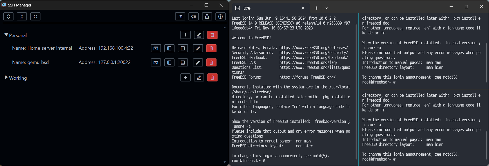

SSH host manager for personal using


## Usage
```sh
./ssh-manager
# or
./ssh-manager &
```

## Requirements
* chrome or chromium or ms-edge
* MS-Windows - Windows Terminal (Download automatically if default installation is not exist)
* Linux / FreeBSD - Tilix (GNOME), or Konsole + `gdbus` (KDE).

## Password asking when executing
* First time - Create `hosts.dat` with the password
* Then - Open `hosts.dat` with the password

## Build
```sh
make
```
